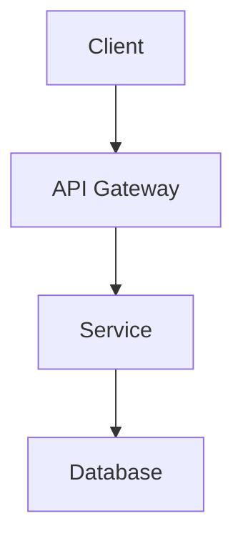

# Architecture

<!-- This is a template. When generated for a specific project, the compliance
     agent will analyze the codebase and produce an accurate architecture doc. -->

## System Overview

<!-- AUTO-GENERATED: High-level description of the system -->

## Components

<!-- AUTO-GENERATED: Description of each component/service -->

## Architecture Diagram

<!-- AUTO-GENERATED: Mermaid diagram showing component relationships -->

## Data Flow

<!-- AUTO-GENERATED: How data moves through the system -->

## Technology Choices

<!-- AUTO-GENERATED: Key technology decisions and rationale -->
